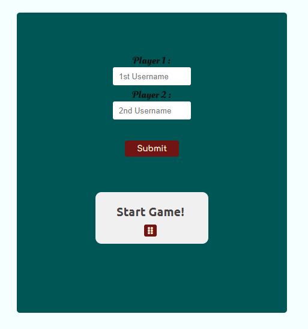
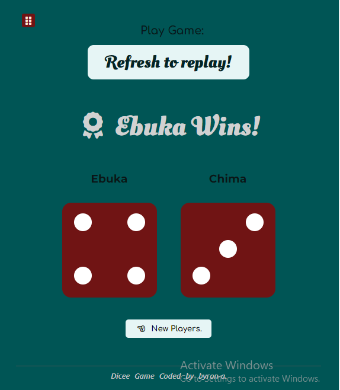

# Dice_Game
My version of the Dice Game

### Screenshots

## Table of contents

- [Overview](#overview)
  - [Links](#links)
  - [Built with](#built-with)
- [Author](#author)

## Overview
I used HTML5 for the proper structuring of the pages and styled with CSS,
The dice box was built using basic svg.
Two JavaScript files where also used separately for the HTML files.
Here the use of DOM was initiated to connect various nodes in the HTML files which allowed for behavioural manipulations

### Links
- Live Site URL: [live page](https://byron-a.github.io/Dice_Game/)

### Built with

- Semantic HTML5 markup
- CSS flex
- media queries
- JavaScript

## Author
byron-a
- Website - https://byron-a.github.io/My_Resume/

